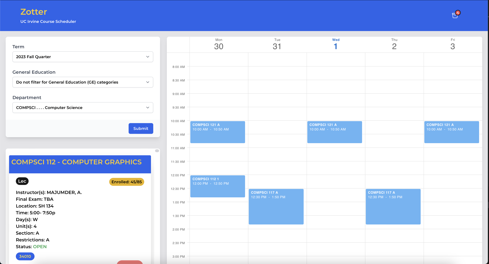
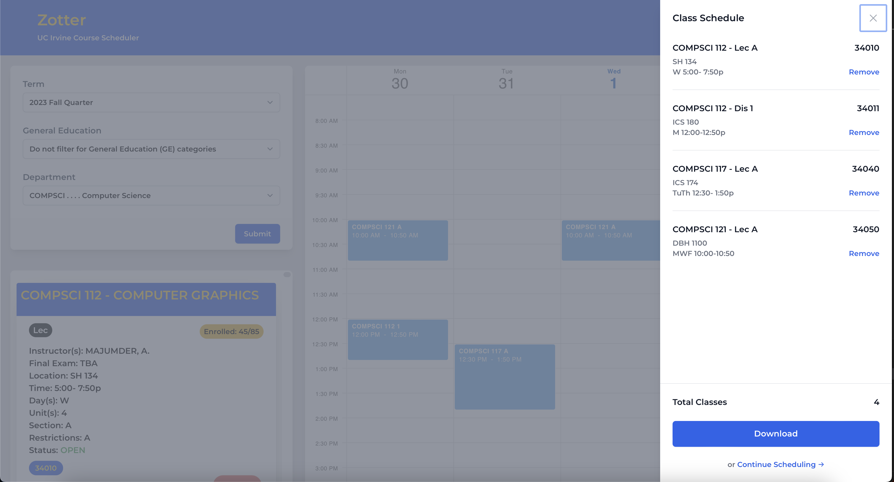

# [Zotter](https://chrisbryann.github.io/Zotter/) - UCI Course Scheduling App

Zotter is a sophisticated course scheduling application meticulously crafted to enhance the course planning experience at the esteemed University of California, Irvine (UCI). With a dedicated commitment to delivering superior user experience and enhanced conventionality, Zotter empowers UCI students to streamline and optimize their class scheduling process.

Key Features:

**Enhanced User Interface**: Immerse yourself in a user-friendly and intuitive interface, providing a seamless course scheduling experience that prioritizes your needs.  

**Improved Conventionality**: Zotter redefines the course planning process for UCI students, offering unmatched convenience and efficiency while easily generating comprehensive summaries of your scheduled classes with unparalleled ease.  
 
 
Embark on your journey with Zotter and experience a transformation in your UCI course planning endeavors. Your academic success starts here.
